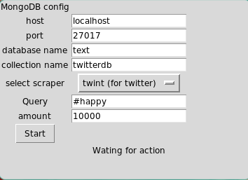

# scraping social media, using MongoDB as nosql storage and doing EDA on #happy tweets and comments from reddit r/happy

### Scrapers used:
* snscrape - for reddit (it can be used for twitter too but i wanted to try different scrapers)
* twint - for twitter

### GUI

scrape_and_save_gui.py

Simple GUI written in tkinter.  
Need to have MongoDB running for storage.  
Can scrape subreddits from reddit or queries from twitter.  

Requires:
* pymongo 
* tkinter
* snscrape
* twint

### EDA

The specific subject for the EDA is about the #happy and r/happy,  
in attempt to gain information about posts with that hashtag/ in r/happy subreddit

* data colected using the script at src/scrape_for_eda.py

Requires:
* pymongo 
* numpy
* pandas
* nltk
* matplotlib
* seaborn
* wordcloud
